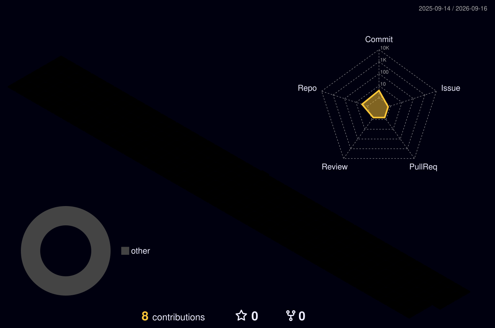

<div align="center">


<a href="https://github.com/manishagowda309-cyber">
  
</a>
<a href="https://linkedin.com/in/manisha-hy-a472822ba">
  
</a>
<a href="mailto:manishagowda309@gmail.com">
  
</a>

<br/><br/>

[](https://git.io/typing-svg)


</div>

<br/>

## 🧑‍💻 About Me

- 🎓 CSE student at **Sampoorna Institute of Technology and Research** (2023–2027) · CGPA **8.3/10**
- 📊 Focused on **data analytics, visualization, and BI-driven decision-making**
- 🧹 Comfortable across the full analytics loop: cleaning → transforming → analyzing → visualizing
- 🤖 Currently building an **AI-powered career intelligence platform** with skill-gap analysis
- 🎯 Looking for an entry-level **Data Analyst** role

<br/>

## 🛠️ Tech Stack

<div align="center">


<br/><br/>


</div>

<br/>

## 🚀 Featured Projects

**🔹 AI-Powered Learning, Skill Tracking & Career Intelligence Platform**
`Python` `SQL` `HTML` `CSS` `JavaScript`
- Built an AI-based platform that analyzes user skills and recommends career paths
- Designed the database schema for user profiles, skills, and learning progress
- Ran skill-gap analysis and generated personalized learning/career recommendations

**🔹 Sales Data Analysis Dashboard**
`Excel` `SQL` `Power BI`
- Cleaned and transformed raw sales datasets, then analyzed trends and customer performance
- Built KPIs and interactive Power BI dashboards
- Delivered business-oriented insights to support data-driven decisions

<br/>

## 📊 GitHub Stats

<div align="center">


</div>

<br/>

## 🧊 3D Contribution Graph

Regular green squares are fine, but a real 3D bar-chart version of your contribution calendar is the thing people actually stop and look at. It's generated by a small GitHub Action ([`yoshi389111/github-profile-3d-contrib`](https://github.com/yoshi389111/github-profile-3d-contrib)) that runs once a day and commits an SVG into your own profile repo — so it's genuinely yours, not a hotlinked demo image.

<details>
<summary><b>⚙️ One-time setup (click to expand)</b></summary>

<br/>

**1. Confirm your profile repo exists**
It's the repo named exactly `manishagowda309-cyber/manishagowda309-cyber` — this README lives inside it.

**2. Add a workflow file** at `.github/workflows/profile-3d.yml`:

```yaml
name: GitHub-Profile-3D-Contrib

on:
  schedule:
    - cron: "0 18 * * *"   # runs once a day
  workflow_dispatch:

permissions:
  contents: write

jobs:
  build:
    runs-on: ubuntu-latest
    steps:
      - uses: actions/checkout@v5
      - uses: yoshi389111/github-profile-3d-contrib@latest
        env:
          GITHUB_TOKEN: ${{ secrets.GITHUB_TOKEN }}
          USERNAME: ${{ github.repository_owner }}
      - name: Commit & Push
        run: |
          git config user.name github-actions
          git config user.email github-actions@github.com
          git add -A .
          if git commit -m "generated"; then git push; fi
```

**3. Run it once manually** — go to **Actions → GitHub-Profile-3D-Contrib → Run workflow**.

**4. Add the image to this README** once the Action has committed the SVGs to `profile-3d-contrib/`:

```markdown

```

Other style options to swap in: `profile-green-animate`, `profile-season-animate`, `profile-night-view`, `profile-gitblock`.

</details>

<br/>

<div align="center">

⭐ Thanks for stopping by — always happy to connect over data, dashboards, or an interesting dataset!

</div>
